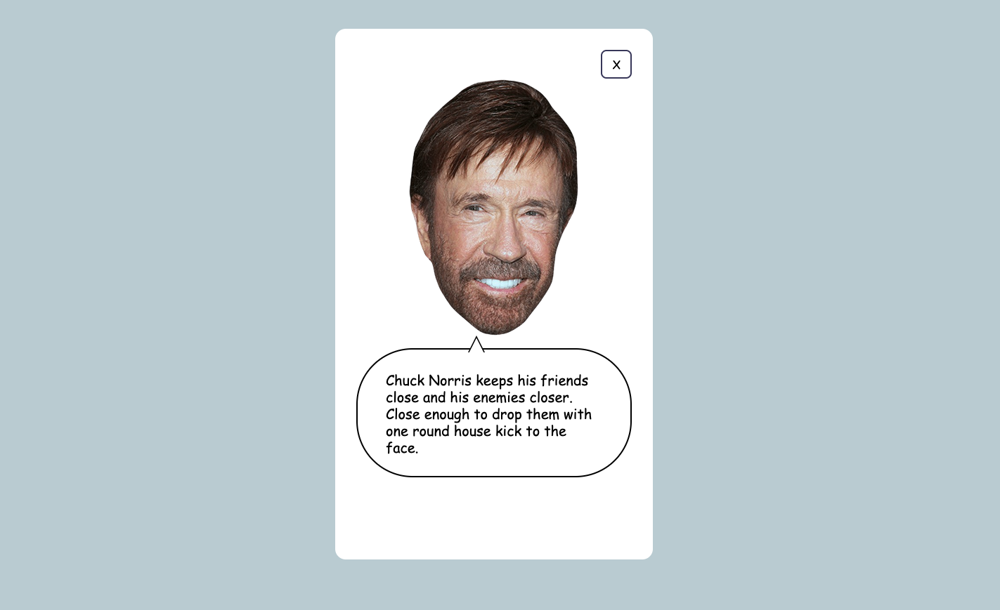

# Chuck Wisdoms

A simple web application that displays random Chuck Norris facts fetched from the Chuck Norris API. Includes CI/CD pipeline using GitHub Actions and AWS CDK for infrastructure.

<p align="center">
  
</p>

## Tech Stack

- **Frontend**: Vanilla HTML, CSS, and JavaScript
- **Build**: esbuild for bundling and minification
- **Infrastructure**: 
  - AWS CDK (TypeScript)
  - S3 bucket for static hosting with proper permissions
  - CloudFront distribution with origin access control
  - Lambda@Edge for security headers
- **CI/CD**: GitHub Actions for PR tests and deployment

## Development

### Prerequisites

- Node.js (version in .nvmrc)
- AWS CLI configured with appropriate credentials

### Quick Start

```bash
# Install dependencies
npm install

# Run development server
npm run dev

# Build project (output to dist/)
npm run build

# Run tests
npm test
```

### Infrastructure Updates

For CDK infrastructure changes:

```bash
cd cdk
npm install
cdk deploy
```

## Deployment

### GitHub Actions

The site is automatically deployed when changes are pushed to master:

1. GHA workflow builds the site
2. Built files are uploaded to S3 bucket
3. CloudFront cache is invalidated to ensure content updates are immediately available 
